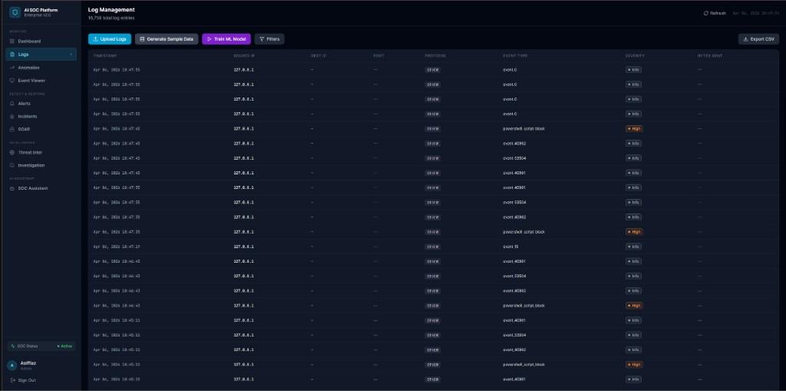
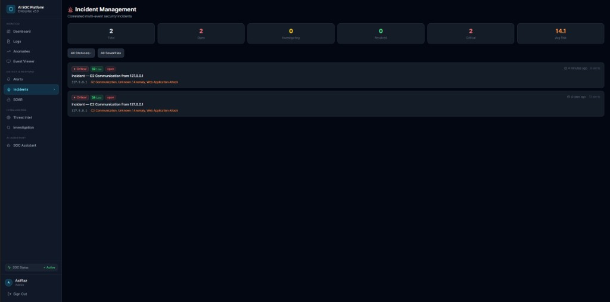
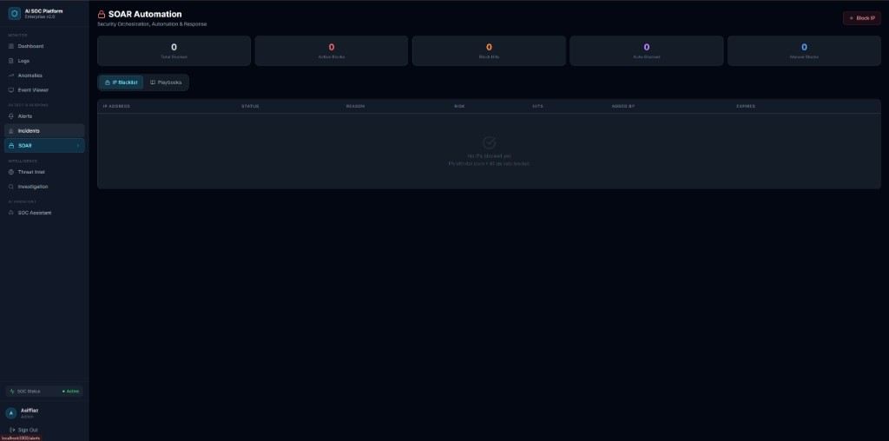
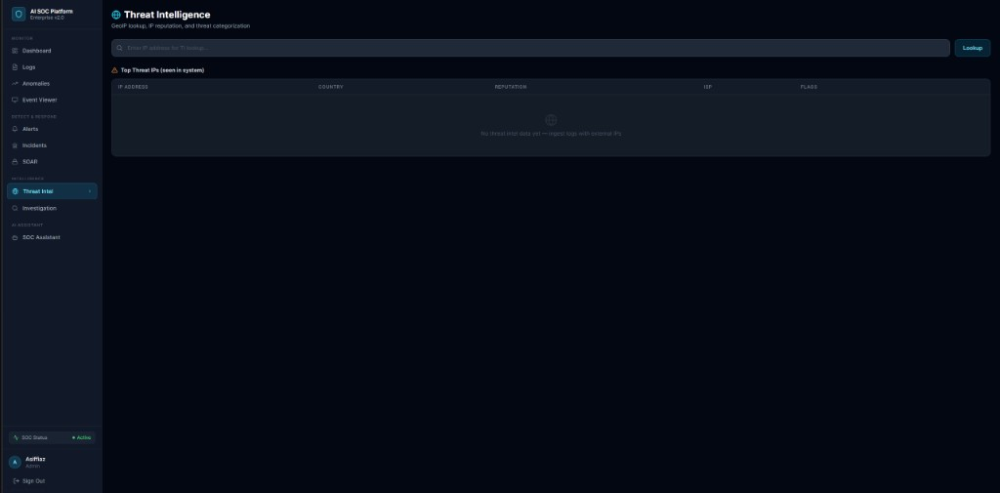
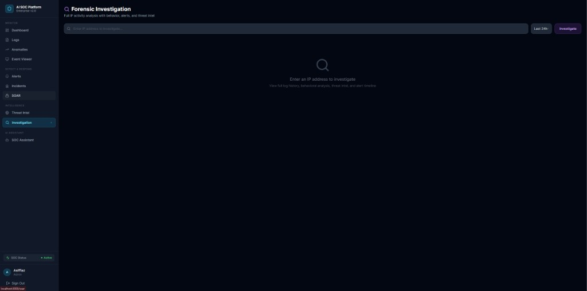
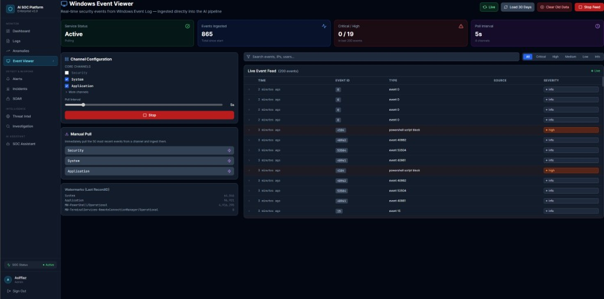
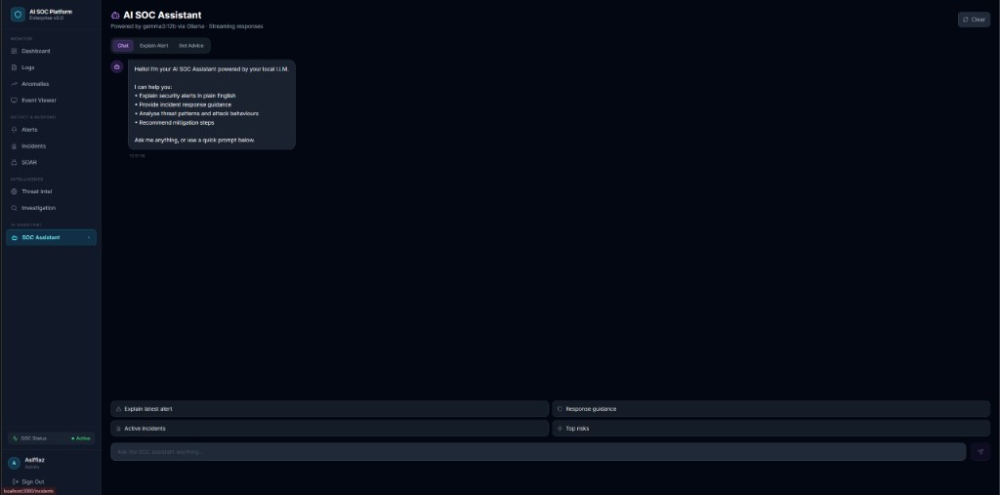

# AI Threat Detection System
### Enterprise SOC Platform — v2.0.0

> **Production-ready Security Operations Center (SOC) platform** with ML-powered anomaly detection, SIEM-style rule engine, LLM threat explanation, automated incident response, threat intelligence, SOAR automation, behavioral profiling, attack classification, and real-time dashboards.

---

## Architecture Overview

```
┌────────────────────────────────────────────────────────────────────────────┐
│                        AI Threat Detection System                          │
├────────────────────────────────────────────────────────────────────────────┤
│                                                                             │
│   ┌─────────────┐      ┌──────────────────────────────────────────────┐   │
│   │   React UI  │─────▶│              FastAPI Backend                  │   │
│   │  (Vite/TS)  │◀─────│                                              │   │
│   │  Port 3000  │  WS  │  Routers: auth, logs, alerts, anomalies,    │   │
│   └─────────────┘      │  dashboard, incidents, intelligence,         │   │
│                         │  investigation, soar, soc-assistant,         │   │
│                         │  event-viewer, websocket                     │   │
│                         │                                              │   │
│                         │  Services: LogService, AlertService,         │   │
│                         │  RuleEngine, LLMService, CorrelationEngine,  │   │
│                         │  ThreatIntelService, SOARService,            │   │
│                         │  RiskScoringService, BehavioralProfileSvc,   │   │
│                         │  ClassificationService, CacheService,        │   │
│                         │  EventViewerService                          │   │
│                         │                                              │   │
│                         │  ML Engine: IsolationForest + LOF,           │   │
│                         │  FeatureEngineering, ModelManager (async)    │   │
│                         └──────────────────────────────────────────────┘   │
│                                    │                   │                    │
│              ┌─────────────────────┘                   │                    │
│              ▼                                         ▼                    │
│   ┌──────────────────┐                   ┌──────────────────┐              │
│   │   PostgreSQL 16  │                   │   Ollama LLM     │              │
│   │  (Async SQLAlch) │                   │  (Llama3/Gemma)  │              │
│   └──────────────────┘                   └──────────────────┘              │
│              │                                                              │
│              ▼                                                              │
│   ┌──────────────────┐                                                     │
│   │      Redis       │                                                     │
│   │  (Cache/Stream/  │                                                     │
│   │   Correlation)   │                                                     │
│   └──────────────────┘                                                     │
└────────────────────────────────────────────────────────────────────────────┘
```

---

## Tech Stack

| Layer         | Technology                           |
|---------------|--------------------------------------|
| Backend       | FastAPI (Python 3.12), async/await   |
| Frontend      | React 18 + Vite + TypeScript         |
| Database      | PostgreSQL 16 (via asyncpg)          |
| ORM           | SQLAlchemy 2.0 (async)               |
| Cache         | Redis 7                              |
| ML/AI         | Scikit-learn (IsolationForest + LOF) |
| LLM           | Ollama (Llama3 / Gemma)              |
| Charts        | Recharts                             |
| Styling       | TailwindCSS + dark mode              |
| Auth          | JWT (HS256) + bcrypt                 |
| State         | Zustand + TanStack Query             |
| Containers    | Docker + Docker Compose              |

---

## Features

### Log Ingestion
- **File upload**: CSV, JSON, syslog, and newline-delimited JSON
- **API streaming**: `POST /api/v1/logs/stream` for real-time ingestion
- **Bulk ingestion**: `POST /api/v1/logs/bulk` for high-throughput batches
- Automatic field normalization from various log formats

### ML Anomaly Detection
- **Ensemble model**: Isolation Forest + Local Outlier Factor
- **Optional PyOD**: install `pyod` for additional models
- Feature engineering: IP behavior, port patterns, traffic volume, time features
- Anomaly scores normalized to [0, 1]; alerts triggered above configurable threshold
- Async training (non-blocking), model persistence to disk

### Rule Engine (SIEM-style)
| Rule | Trigger |
|------|---------|
| `brute_force_login` | 5+ failed logins from same IP in 10 min |
| `port_scan` | 20+ unique ports from same IP in 10 min |
| `ddos_flood` | 200+ requests/minute from single IP |
| `suspicious_port_access` | Connection to backdoor ports (4444, 1337, etc.) |
| `privilege_escalation` | Privilege escalation event types |
| `data_exfiltration` | Outbound transfer > 50MB |
| `critical_severity_event` | Any CRITICAL severity log |

Rules are fully manageable via REST API — create, update, enable/disable, and test rules against sample log payloads without restarting the server.

### Attack Classification Engine
Classifies every alert into one of **14 MITRE ATT&CK-aligned attack categories** using a multi-signal decision tree:

| Category | Examples |
|---|---|
| Brute Force | SSH/RDP repeated login failures |
| Port Scanning | Rapid sequential port probing |
| DDoS / Flood | SYN flood, HTTP flood |
| Suspicious Login | Off-hours, geo-anomaly logins |
| Data Exfiltration | Large outbound transfers |
| SQL Injection | SQLi payloads in HTTP logs |
| Web Application Attack | XSS, LFI, RCE via HTTP |
| C2 Communication | Beacon patterns, C2 domain calls |
| DNS Tunneling | Unusually long DNS queries |
| Remote Code Execution | Shell execution events |
| Credential Stuffing | High-volume multi-account failures |
| Internal Reconnaissance | Internal subnet scanning |
| Lateral Movement | East-west movement between hosts |
| Unknown / Anomaly | ML-detected without rule match |

Signal priority: rule engine match → ML pattern → behavioral signals → heuristic fallback. Each classification includes a **confidence score (0–1)** and human-readable reasoning.

### AI Threat Explanation
- Integrates with local **Ollama** LLM (Llama3, Gemma, etc.)
- Generates: threat explanation, attack type, MITRE ATT&CK TTPs, mitigation steps
- **Graceful fallback**: rule-based analysis when Ollama is offline

### AI SOC Assistant
- **Chat-style natural language interface** for analysts — ask questions about any alert or incident
- Context-aware: pulls live alert data, incident details, and log history from the database before answering
- Dedicated endpoints: explain alert, advise on remediation, summarize incident
- **Streaming responses** (SSE) for low-latency interactive experience
- Powered by the same local Ollama LLM with graceful fallback

### Incident Management
- **Automated incident creation** via the Correlation Engine — no manual grouping needed
- Correlation strategies:
  - `SAME_IP_BURST` — 3+ alerts from same IP within 5 minutes
  - `MULTI_RULE_CHAIN` — 2+ different rule types from same IP within 15 min
  - `MULTI_USER_TARGETING` — same IP hitting multiple users within 10 min
  - `HIGH_RISK_SINGLE` — single alert with risk score ≥ 85
- Full incident lifecycle: `open → investigating → contained → resolved → closed`
- Alert timeline view per incident
- Escalation workflow with severity promotion
- Incident summary statistics

### Threat Intelligence
- **GeoIP enrichment** via ip-api.com (country, city, ISP, org, ASN)
- **IP reputation scoring** via AbuseIPDB (optional API key)
- **Internal known-bad dataset**: CISA KEV ranges, Tor exit nodes, common scanners
- Two-tier cache: Redis (1-hour TTL) → PostgreSQL (long-term history)
- Bulk IP lookup endpoint
- Top-threats leaderboard

### IP Investigation & Forensics
- **Forensic report per IP**: full behavioral summary, risk score, threat intel, correlated alerts
- Recent log history for any IP
- Per-IP behavioral profiling (request patterns, port diversity, failure rates)
- Alert history for any IP
- Alert-level deep-dive investigation

### SOAR (Security Orchestration, Automation & Response)
- **IP blacklisting** with reason, expiry, and hit counter
- Redis hot-set for O(1) block checks at ingestion time — malicious IPs are blocked before processing
- **Automated playbooks** for each attack type with step-by-step response actions
- One-click automated response on any alert: runs the matching playbook and (optionally) blocks the source IP
- Playbook library covers: Brute Force, Port Scan, DDoS, Data Exfiltration, Privilege Escalation, Suspicious Port Access
- SOAR statistics: blocked IPs, total block hits, auto-blocked count, active playbooks
- **Auto-block on high risk**: IPs exceeding the configurable risk threshold are automatically blocked at ingestion time

### Risk Scoring
- Dynamic **composite risk score** (0–100) per alert, combining:
  - Rule-based severity weight
  - ML anomaly score
  - Threat intelligence reputation
  - Behavioral profile signals
- Automatic severity reclassification based on final score
- **Auto-block**: IPs scoring ≥ 85 are automatically added to the SOAR blacklist

### Behavioral Profiling
- Per-IP and per-user behavioral baselines maintained in Redis
- **Short window (1h):** request count, failed logins, unique ports, unique destinations, bytes out, alert count
- **Long window (24h):** rolling request and failure counters
- **Baseline snapshots** updated every 15 minutes (7-day retention)
- **Deviation score (0–1)** fed into the risk scoring pipeline — flags anomalies even when no individual rule fires
- Detects new/first-seen IP sources automatically

### Event Viewer
- **Windows Event Log-style live viewer** — monitors raw Redis streams and log channels
- **Auto-starts on Windows** at application boot — zero-configuration real-time threat feed
- Start/stop real-time monitoring, pull-now on demand
- Channel status inspection and watermark management
- Diagnostic endpoint for troubleshooting ingestion pipelines
- Purge sample data and reset stream watermarks via API

### Startup Auto-Initialization
On every startup the platform automatically:
- Runs DB schema migrations (zero-downtime)
- Connects Redis and syncs the SOAR IP blacklist into the hot-set
- Loads or **auto-trains** the ML anomaly model from existing DB logs (no manual step needed)
- Starts the Windows Event Viewer integration (Windows hosts only)
- All subsystem health is exposed at `GET /api/v1/status`

### Dashboard
- Real-time KPIs: total logs, open alerts, anomalies, events/hour
- Charts: traffic timeline, severity distribution, top IPs, anomaly trends
- WebSocket-powered live alert notifications
- Alert management with status updates and AI analysis on-demand

### Security
- JWT Bearer authentication (access + refresh tokens)
- Role-based access: Admin (full control) / Analyst (read + analyze)
- bcrypt password hashing
- CORS, GZip middleware
- Non-root Docker containers

---

## Project Structure

```
AI Threat Detection System/
├── backend/
│   ├── app/
│   │   ├── main.py                        # FastAPI app, middleware, lifespan
│   │   ├── core/
│   │   │   ├── config.py                  # Pydantic settings from .env
│   │   │   ├── database.py                # Async SQLAlchemy engine + sessions
│   │   │   ├── db_migrations.py           # Runtime schema migrations
│   │   │   ├── security.py                # JWT + bcrypt
│   │   │   └── dependencies.py            # FastAPI dependency injection
│   │   ├── models/                        # SQLAlchemy ORM models
│   │   │   ├── user.py
│   │   │   ├── log_entry.py
│   │   │   ├── alert.py
│   │   │   ├── anomaly.py
│   │   │   ├── incident.py                # Incident model
│   │   │   ├── threat_intel.py            # Threat intel cache model
│   │   │   └── blacklist.py               # IP blacklist model
│   │   ├── schemas/                       # Pydantic validation schemas
│   │   ├── routers/                       # FastAPI route handlers
│   │   │   ├── auth.py
│   │   │   ├── logs.py
│   │   │   ├── alerts.py
│   │   │   ├── anomalies.py
│   │   │   ├── dashboard.py
│   │   │   ├── rules.py                   # Detection rules CRUD + test
│   │   │   ├── incidents.py               # Incident management
│   │   │   ├── intelligence.py            # Threat intelligence
│   │   │   ├── investigation.py           # IP forensics
│   │   │   ├── soar.py                    # SOAR & IP blacklist
│   │   │   ├── soc_assistant.py           # AI SOC chat assistant
│   │   │   ├── event_viewer.py            # Live event viewer
│   │   │   └── websocket.py
│   │   ├── services/                      # Business logic layer
│   │   │   ├── log_service.py             # Ingestion, parsing, bulk ops
│   │   │   ├── alert_service.py           # Alert CRUD + WebSocket broadcast
│   │   │   ├── rule_engine.py             # SIEM-style detection rules
│   │   │   ├── llm_service.py             # Ollama LLM integration
│   │   │   ├── correlation_service.py     # Alert → Incident correlation
│   │   │   ├── threat_intel_service.py    # GeoIP + IP reputation
│   │   │   ├── soar_service.py            # Playbooks + IP blocking
│   │   │   ├── risk_scoring_service.py    # Composite risk scoring
│   │   │   ├── behavioral_profile_service.py  # Per-IP behavior analysis
│   │   │   ├── classification_service.py  # Attack type classification
│   │   │   ├── cache_service.py           # Redis cache abstraction
│   │   │   └── event_viewer_service.py    # Real-time event streaming
│   │   ├── ml/                            # ML/AI components
│   │   │   ├── feature_engineering.py
│   │   │   ├── anomaly_detector.py        # IF + LOF ensemble
│   │   │   ├── model_manager.py           # Async model lifecycle
│   │   │   └── model_trainer.py           # On-demand + scheduled retraining
│   │   └── utils/
├── frontend/
│   ├── src/
│   │   ├── components/
│   │   │   ├── Layout/                    # Sidebar, Header, AppLayout
│   │   │   ├── Dashboard/                 # Charts: Traffic, Severity, TopIPs, Anomaly
│   │   │   └── common/                    # StatCard, SeverityBadge, RiskBadge, Spinner
│   │   ├── pages/
│   │   │   ├── DashboardPage.tsx
│   │   │   ├── AlertsPage.tsx
│   │   │   ├── IncidentsPage.tsx          # Incident management
│   │   │   ├── IntelligencePage.tsx       # Threat intelligence
│   │   │   ├── InvestigationPage.tsx      # IP forensics
│   │   │   ├── SOARPage.tsx               # SOAR & playbooks
│   │   │   ├── SOCAssistantPage.tsx       # AI chat assistant
│   │   │   └── EventViewerPage.tsx        # Live event viewer
│   │   ├── services/api.ts                # Axios client with JWT interceptors
│   │   ├── hooks/useWebSocket.ts
│   │   ├── store/authStore.ts             # Zustand auth state
│   │   ├── types/index.ts                 # TypeScript type definitions
│   │   └── utils/formatters.ts
│   ├── package.json
│   ├── vite.config.ts
│   ├── tailwind.config.js
│   ├── nginx.conf
│   └── Dockerfile
├── scripts/
│   ├── init.sql                           # DB initialization
│   └── create_admin.py                    # Initial admin user creation
├── START_BACKEND_ADMIN.bat                # Windows quick-start helper
├── docker-compose.yml
├── .env.example
└── README.md
```

---

## Quick Start

### Prerequisites
- Docker Desktop (or Docker Engine + Compose)
- 8GB RAM recommended (Ollama LLM)
- Optional: NVIDIA GPU for faster LLM inference

### 1. Clone and Configure

```bash
git clone https://github.com/iamasiffiaz/AI-Threat-Detection-System.git
cd "AI Threat Detection System"
cp .env.example .env
# Edit .env and set a strong SECRET_KEY
```

### 2. Start Services

```bash
# Start all services
docker compose up -d

# Pull the Ollama LLM model (first time only, ~4GB)
docker compose --profile setup up ollama-pull

# Create the admin user
docker compose exec backend python scripts/create_admin.py
```

### 3. Access the Application

| Service       | URL                            |
|---------------|--------------------------------|
| Dashboard     | http://localhost:3000          |
| API Docs      | http://localhost:8000/api/docs |
| ReDoc         | http://localhost:8000/api/redoc|

**Default credentials:**
- Username: `admin`
- Password: `Admin1234!`

> Change immediately after first login!

### 4. Generate Test Data

After logging in, go to **Logs → Generate Sample Data** to populate 500 synthetic log entries and trigger automatic rule/ML detection.

Then click **Train ML Model** to train the anomaly detector on the generated data.

---

## Local Development (without Docker)

### Backend

```bash
cd backend

# Create virtual environment
python -m venv .venv
.venv\Scripts\activate  # Windows
source .venv/bin/activate  # Linux/macOS

# Install dependencies
pip install -r requirements.txt

# Set environment variables
cp .env.example .env
# Edit .env with your local PostgreSQL/Redis URLs

# Run development server
uvicorn app.main:app --reload --port 8000
```

### Frontend

```bash
cd frontend

npm install
npm run dev  # Starts on http://localhost:3000
```

---

## API Reference

### Authentication
| Method | Endpoint               | Description               | Auth  |
|--------|------------------------|---------------------------|-------|
| POST   | `/api/v1/auth/login`   | Get JWT tokens            | No    |
| POST   | `/api/v1/auth/refresh` | Refresh access token      | No    |
| GET    | `/api/v1/auth/me`      | Current user profile      | Yes   |
| POST   | `/api/v1/auth/register`| Create user (admin only)  | Admin |

### Log Ingestion
| Method | Endpoint                       | Description                  |
|--------|--------------------------------|------------------------------|
| POST   | `/api/v1/logs/stream`          | Ingest single log entry      |
| POST   | `/api/v1/logs/bulk`            | Ingest batch of log entries  |
| POST   | `/api/v1/logs/upload`          | Upload CSV/JSON/syslog file  |
| GET    | `/api/v1/logs`                 | List logs with pagination    |
| GET    | `/api/v1/logs/statistics`      | Aggregated log statistics    |
| POST   | `/api/v1/logs/generate-sample` | Generate synthetic test data |
| POST   | `/api/v1/logs/train-model`     | Train ML anomaly model       |

### Alerts
| Method | Endpoint                       | Description                  |
|--------|--------------------------------|------------------------------|
| GET    | `/api/v1/alerts`               | List alerts with filters     |
| GET    | `/api/v1/alerts/summary`       | Alert statistics summary     |
| GET    | `/api/v1/alerts/{id}`          | Get specific alert           |
| PATCH  | `/api/v1/alerts/{id}`          | Update alert status          |
| POST   | `/api/v1/alerts/{id}/analyze`  | Trigger LLM analysis         |

### Anomalies
| Method | Endpoint                        | Description                |
|--------|---------------------------------|----------------------------|
| GET    | `/api/v1/anomalies`             | List detected anomalies    |
| GET    | `/api/v1/anomalies/trends`      | Hourly anomaly trends      |
| GET    | `/api/v1/anomalies/top-ips`     | Most anomalous source IPs  |
| GET    | `/api/v1/anomalies/model-info`  | ML model metadata          |

### Incidents
| Method | Endpoint                              | Description                    |
|--------|---------------------------------------|--------------------------------|
| GET    | `/api/v1/incidents`                   | List incidents with filters    |
| GET    | `/api/v1/incidents/summary`           | Incident statistics            |
| GET    | `/api/v1/incidents/{id}`              | Get specific incident          |
| GET    | `/api/v1/incidents/{id}/timeline`     | Alert timeline for incident    |
| PATCH  | `/api/v1/incidents/{id}`              | Update incident status         |
| POST   | `/api/v1/incidents/{id}/escalate`     | Escalate incident severity     |
| DELETE | `/api/v1/incidents/{id}`              | Delete incident (admin only)   |

### Threat Intelligence
| Method | Endpoint                        | Description                    |
|--------|---------------------------------|--------------------------------|
| GET    | `/api/v1/intelligence/ip/{ip}`  | Full TI report for IP          |
| GET    | `/api/v1/intelligence/ip/{ip}/geo` | GeoIP data for IP           |
| POST   | `/api/v1/intelligence/bulk`     | Bulk IP lookup                 |
| GET    | `/api/v1/intelligence/top-threats` | Top threat IPs leaderboard  |

### Investigation
| Method | Endpoint                           | Description                    |
|--------|------------------------------------|--------------------------------|
| GET    | `/api/v1/investigation/ip/{ip}`    | Full forensic report for IP    |
| GET    | `/api/v1/investigation/ip/{ip}/logs` | Recent log history for IP    |
| GET    | `/api/v1/investigation/ip/{ip}/alerts` | Alerts for IP              |
| GET    | `/api/v1/investigation/ip/{ip}/behavior` | Behavioral profile for IP|
| GET    | `/api/v1/investigation/alert/{id}` | Deep-dive on specific alert    |

### SOAR
| Method | Endpoint                           | Description                    |
|--------|------------------------------------|--------------------------------|
| GET    | `/api/v1/soar/blacklist`           | List blocked IPs               |
| GET    | `/api/v1/soar/blacklist/{ip}`      | Check if IP is blocked         |
| POST   | `/api/v1/soar/blacklist`           | Block an IP                    |
| DELETE | `/api/v1/soar/blacklist/{ip}`      | Unblock an IP                  |
| GET    | `/api/v1/soar/playbooks`           | List all playbooks             |
| GET    | `/api/v1/soar/playbooks/{type}`    | Get playbook for attack type   |
| POST   | `/api/v1/soar/respond/{alert_id}`  | Trigger automated response     |
| GET    | `/api/v1/soar/stats`               | SOAR statistics                |

### AI SOC Assistant
| Method | Endpoint                                 | Description                         |
|--------|------------------------------------------|-------------------------------------|
| POST   | `/api/v1/soc-assistant/ask`              | Ask a free-form question            |
| POST   | `/api/v1/soc-assistant/explain/{id}`     | Explain a specific alert            |
| POST   | `/api/v1/soc-assistant/advise/{id}`      | Get remediation advice for alert    |
| POST   | `/api/v1/soc-assistant/incident/{id}`    | Summarize an incident               |
| POST   | `/api/v1/soc-assistant/stream/ask`       | Streaming free-form question        |
| POST   | `/api/v1/soc-assistant/stream/explain/{id}` | Streaming alert explanation    |
| POST   | `/api/v1/soc-assistant/stream/advise/{id}`  | Streaming remediation advice   |
| POST   | `/api/v1/soc-assistant/stream/incident/{id}` | Streaming incident summary    |

### Event Viewer
| Method | Endpoint                            | Description                     |
|--------|-------------------------------------|---------------------------------|
| GET    | `/api/v1/event-viewer/status`       | Viewer status                   |
| POST   | `/api/v1/event-viewer/start`        | Start live monitoring           |
| POST   | `/api/v1/event-viewer/stop`         | Stop live monitoring            |
| GET    | `/api/v1/event-viewer/recent`       | Recent events                   |
| POST   | `/api/v1/event-viewer/pull-now`     | Force-pull from channels        |
| GET    | `/api/v1/event-viewer/channels`     | Channel status                  |
| POST   | `/api/v1/event-viewer/reset-watermarks` | Reset stream watermarks     |
| GET    | `/api/v1/event-viewer/diagnose`     | Diagnose ingestion pipeline     |

### Detection Rules
| Method | Endpoint                        | Description                       |
|--------|---------------------------------|-----------------------------------|
| GET    | `/api/v1/rules`                 | List all detection rules          |
| POST   | `/api/v1/rules`                 | Create a new rule (admin)         |
| GET    | `/api/v1/rules/{id}`            | Get specific rule                 |
| PUT    | `/api/v1/rules/{id}`            | Update rule (admin)               |
| DELETE | `/api/v1/rules/{id}`            | Delete rule (admin)               |
| POST   | `/api/v1/rules/{id}/toggle`     | Enable / disable rule (admin)     |
| POST   | `/api/v1/rules/test`            | Test rule against a sample log    |

### Dashboard
| Method | Endpoint                       | Description               |
|--------|--------------------------------|---------------------------|
| GET    | `/api/v1/dashboard/overview`   | All KPIs in one request   |

### Health & Status
| Method | Endpoint            | Description                                   |
|--------|---------------------|-----------------------------------------------|
| GET    | `/health`           | Liveness probe (returns `{"status":"healthy"}`) |
| GET    | `/api/v1/status`    | Full subsystem status: ML, LLM, Redis, SOAR, correlation, event viewer |

### WebSocket
| Endpoint                   | Description                           |
|----------------------------|---------------------------------------|
| `ws://host/ws/alerts`      | Real-time alert stream                |
| `ws://host/ws/logs/stream` | Simulated real-time log stream        |

Authentication: pass `?token=<jwt>` as query parameter.

---

## Configuration Reference

All settings are loaded from environment variables (`.env` file):

### Application
| Variable                      | Default        | Description                                   |
|-------------------------------|----------------|-----------------------------------------------|
| `APP_NAME`                    | `AI SOC Platform` | Application display name                   |
| `ENVIRONMENT`                 | `production`   | `production` or `development`                 |
| `DEBUG`                       | `false`        | Enables verbose logging                       |

### Database
| Variable                      | Default        | Description                                   |
|-------------------------------|----------------|-----------------------------------------------|
| `DATABASE_URL`                | —              | PostgreSQL async connection string            |
| `DATABASE_POOL_SIZE`          | `10`           | SQLAlchemy connection pool size               |
| `DATABASE_MAX_OVERFLOW`       | `20`           | Max extra connections above pool size         |

### Redis
| Variable                      | Default        | Description                                   |
|-------------------------------|----------------|-----------------------------------------------|
| `REDIS_URL`                   | `redis://localhost:6379` | Redis connection URL            |
| `REDIS_CACHE_TTL`             | `300`          | Default cache TTL in seconds (5 min)          |

### Authentication
| Variable                      | Default        | Description                                   |
|-------------------------------|----------------|-----------------------------------------------|
| `SECRET_KEY`                  | —              | JWT signing key (min 32 chars)                |
| `ACCESS_TOKEN_EXPIRE_MINUTES` | `60`           | JWT access token lifetime                     |
| `REFRESH_TOKEN_EXPIRE_DAYS`   | `7`            | JWT refresh token lifetime                    |

### LLM
| Variable                      | Default        | Description                                   |
|-------------------------------|----------------|-----------------------------------------------|
| `OLLAMA_BASE_URL`             | `http://localhost:11434` | Ollama API endpoint            |
| `OLLAMA_MODEL`                | `llama3`       | LLM model name                                |
| `OLLAMA_TIMEOUT`              | `60`           | LLM request timeout in seconds                |

### ML Model
| Variable                      | Default        | Description                                   |
|-------------------------------|----------------|-----------------------------------------------|
| `ANOMALY_THRESHOLD`           | `0.6`          | Score above which anomaly alerts fire         |
| `MIN_TRAINING_SAMPLES`        | `100`          | Minimum logs required for ML training         |
| `MODEL_RETRAIN_INTERVAL_HOURS`| `24`           | Auto-retrain interval                         |

### Alert & Rule Engine
| Variable                      | Default        | Description                                   |
|-------------------------------|----------------|-----------------------------------------------|
| `ALERT_COOLDOWN_SECONDS`      | `300`          | Minimum gap between same-rule alerts per IP   |
| `MAX_ALERTS_PER_IP_PER_HOUR`  | `10`           | Rate-limit on alerts from a single IP         |
| `FAILED_LOGIN_THRESHOLD`      | `5`            | Failed logins before brute-force alert        |
| `PORT_SCAN_THRESHOLD`         | `20`           | Unique ports before port scan alert           |
| `TRAFFIC_SPIKE_MULTIPLIER`    | `3.0`          | Traffic spike multiplier for DDoS detection   |

### File Upload
| Variable                      | Default        | Description                                   |
|-------------------------------|----------------|-----------------------------------------------|
| `MAX_UPLOAD_SIZE_MB`          | `50`           | Maximum log file upload size                  |
| `ALLOWED_UPLOAD_EXTENSIONS`   | `.csv .json .log .txt` | Accepted file extensions           |

### Threat Intelligence
| Variable                      | Default        | Description                                   |
|-------------------------------|----------------|-----------------------------------------------|
| `ABUSEIPDB_API_KEY`           | —              | Optional: AbuseIPDB key for live IP reputation|

### SOAR & Incident Correlation
| Variable                      | Default        | Description                                   |
|-------------------------------|----------------|-----------------------------------------------|
| `AUTO_BLOCK_RISK_THRESHOLD`   | `85.0`         | Risk score above which IPs are auto-blocked   |
| `INCIDENT_BURST_THRESHOLD`    | `3`            | Alerts in 5 min to auto-create an incident    |
| `INCIDENT_AUTO_RISK_THRESHOLD`| `85.0`         | Single-alert risk score for auto-incident     |

---

## Deployment

### Production Checklist

- [ ] Set a strong, random `SECRET_KEY` (min 32 chars)
- [ ] Change default `POSTGRES_PASSWORD`
- [ ] Change admin password after first login
- [ ] Configure `ALLOWED_ORIGINS` to your actual domain
- [ ] Enable HTTPS (reverse proxy: Traefik, Nginx, Caddy)
- [ ] Set `DEBUG=false` and `ENVIRONMENT=production`
- [ ] Configure log retention policy in PostgreSQL
- [ ] Set up database backups
- [ ] Monitor with Prometheus + Grafana (metrics endpoint included)
- [ ] Optionally set `ABUSEIPDB_API_KEY` for live IP reputation data

### Scaling

The backend supports **horizontal scaling** — run multiple instances behind a load balancer. ML models are persisted to a shared volume. Redis is used for shared correlation state, blacklist hot-set, and TI caching across all instances.

---

## Screenshots

### SOC Dashboard

*Real-time KPIs, incident status, alert severity distribution, system health, log traffic chart, and ML detection engine status.*

### Log Management

*Upload logs, generate sample data, train the ML model, and browse all ingested log entries with filtering.*

### Anomaly Detection

*ML model info, anomaly trends chart, top anomalous IPs, and recent anomaly list with scores.*

### Alerts

*Full alert list with severity badges, attack type classification, risk scores, GeoIP, and status tracking.*

### Incident Management

*Auto-correlated incidents with severity, linked alert count, status lifecycle, and avg risk score.*

### SOAR Automation

*IP blacklist management, block statistics, and automated response playbooks per attack type.*

### Threat Intelligence

*GeoIP enrichment, IP reputation lookup, ISP/ASN info, and top threat IPs seen in the system.*

### Forensic Investigation

*Per-IP forensic drill-down: behavioral profile, threat intel, log history, and correlated alert timeline.*

### Windows Event Viewer

*Real-time Windows Event Log ingestion with channel configuration, live event feed, watermarks, and manual pull.*

### AI SOC Assistant

*Chat-style LLM interface for analysts — explain alerts, get remediation advice, and summarize incidents in plain English.*

---

## License

MIT — see [LICENSE](LICENSE)

---

*Built as a production-grade SOC platform demonstrating ML anomaly detection, LLM-powered threat intelligence, automated incident response (SOAR), real-time correlation, and an AI SOC assistant.*
