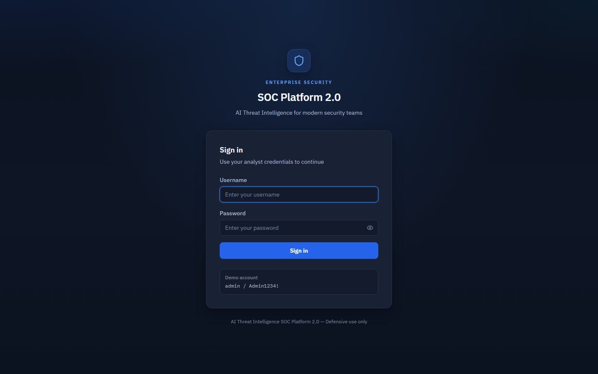
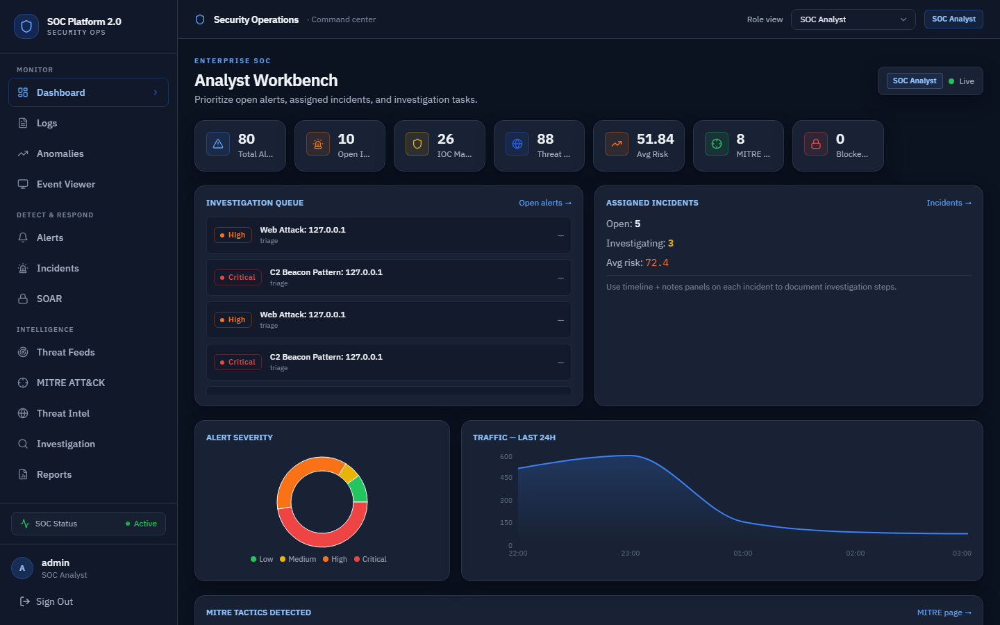
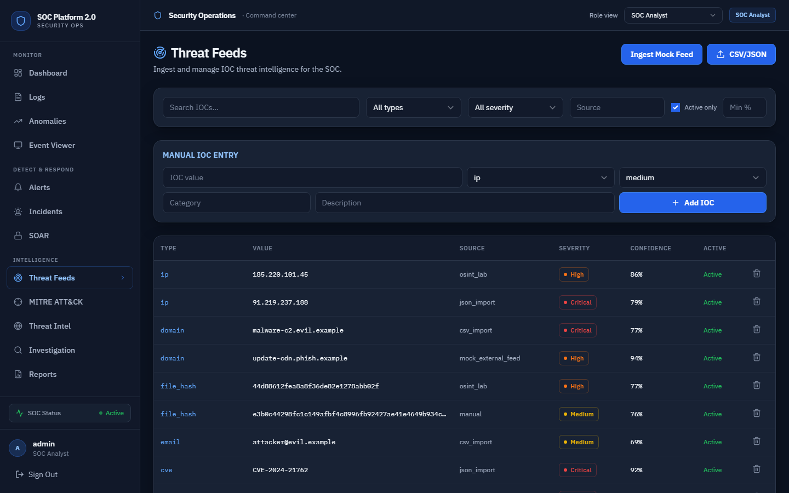
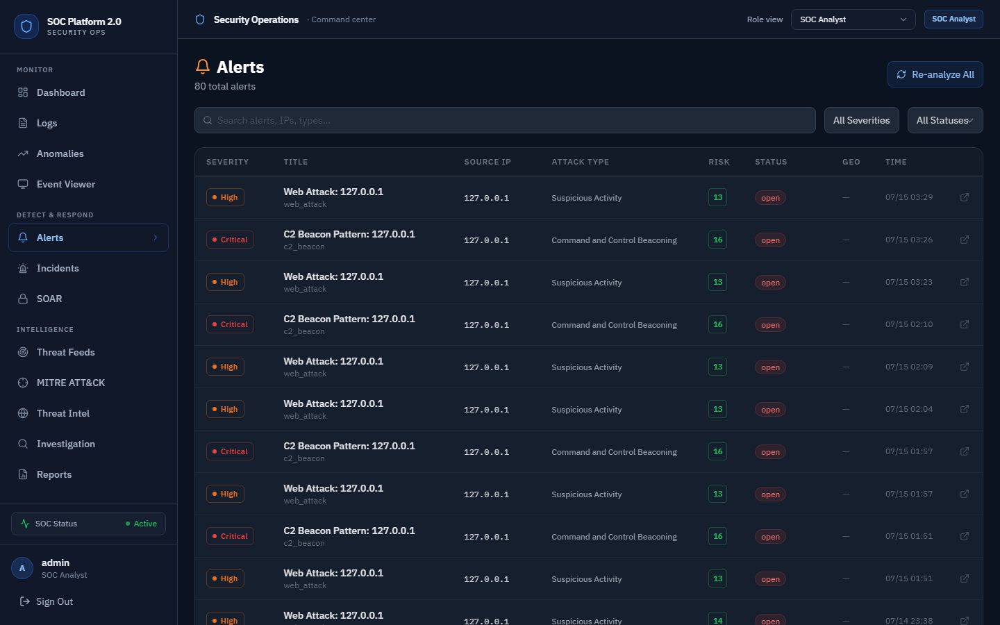
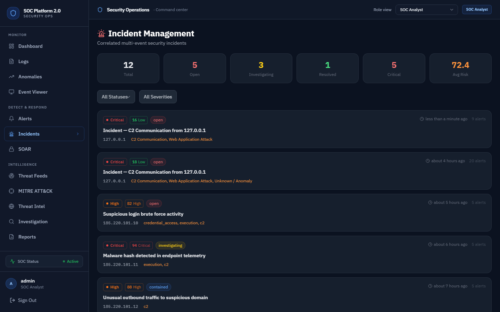
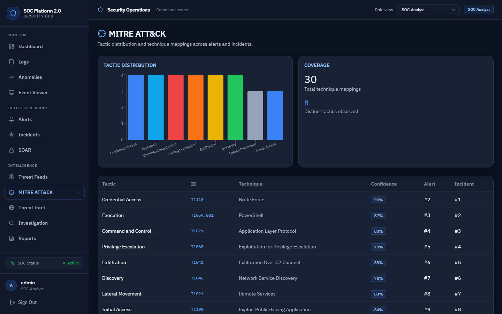
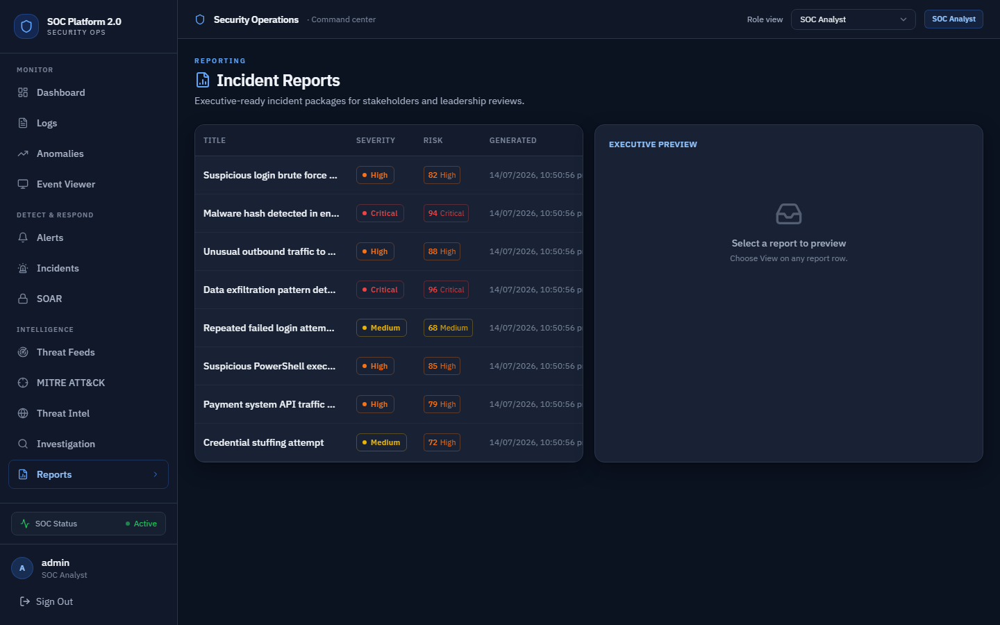
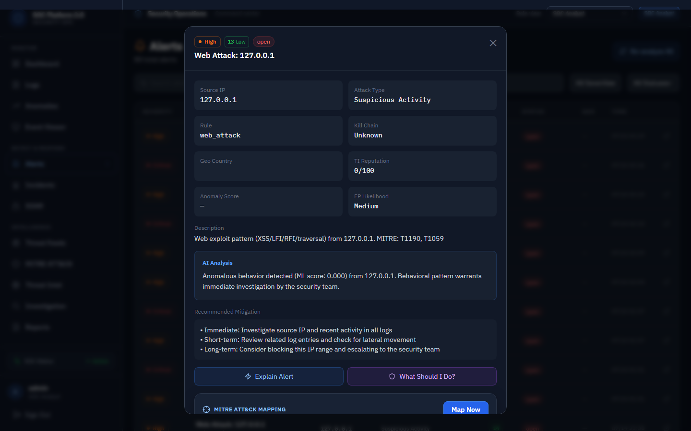
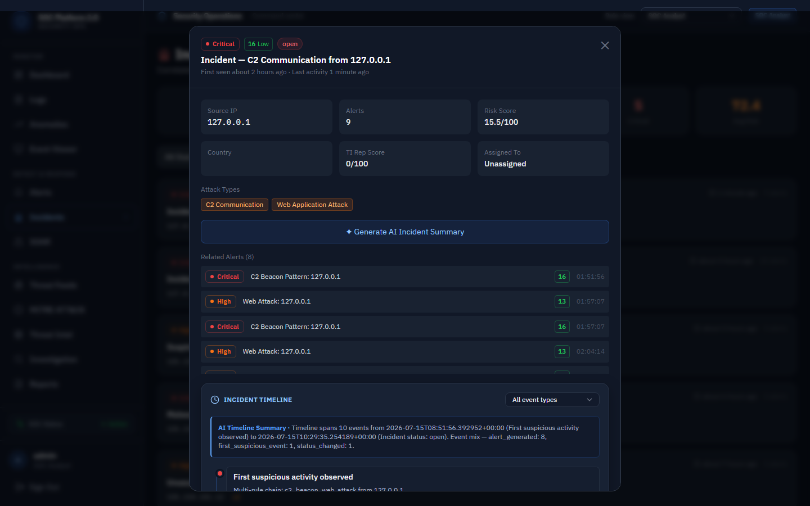

# AI Threat Intelligence SOC Platform 2.0

Defensive AI-powered Security Operations Center platform for threat detection, investigation, threat intelligence, MITRE ATT&CK mapping, severity scoring, timeline reconstruction, analyst workflow, and executive incident reporting.

> **Safety note:** This project is for defensive cybersecurity only — detection, monitoring, analysis, reporting, alerting, threat intelligence enrichment, and incident response. It does not include offensive exploitation, malware generation, credential theft, or attacker bypass techniques.

---

## Short Description

**AI Threat Intelligence SOC Platform 2.0** upgrades a production-style FastAPI + React SOC stack with threat feed ingestion, IOC extraction, MITRE ATT&CK mapping, hybrid alert severity scoring, LLM-based incident explanation, timeline reconstruction, analyst notes, PDF incident reports, and role-based dashboards.

---

## Problem

Security teams are flooded with raw alerts, fragmented indicator data, and incomplete investigation context. Analysts must manually extract IOCs, map ATT&CK techniques, reconstruct timelines, score severity, and write executive reports — slowing response time and increasing operational risk.

## Solution

The platform correlates ML anomaly detection and SIEM-style rules with threat intelligence feeds, then structures investigations through IOC extraction, MITRE mapping, severity scoring, timeline reconstruction, analyst notes, and AI-generated incident explanations/reports.

## Business Value

AI Threat Intelligence SOC Platform 2.0 helps security teams detect, investigate, and explain threats faster by combining ML-based anomaly detection, SIEM-style rules, threat intelligence feeds, IOC extraction, MITRE ATT&CK mapping, alert severity scoring, timeline reconstruction, analyst notes, and AI-generated incident reports. The platform improves SOC productivity by turning raw alerts into structured investigations and executive-ready reports.

---

## Key Features

| Capability | Description |
|---|---|
| Threat feed ingestion | Manual IOC entry, CSV/JSON import, mock external feed ingestion |
| IOC extraction engine | Extract IPs, domains, URLs, hashes, emails, CVEs, filenames, malware keywords |
| MITRE ATT&CK mapping | Tactic/technique mapping with confidence + recommendations |
| Hybrid severity scoring | ML + SIEM + TI + asset/user risk + MITRE + FP history (1–100) |
| LLM incident explanation | Defensive what/why/impact/containment/checklist summaries (mock fallback) |
| Timeline reconstruction | Vertical analyst timeline with gaps + AI summary |
| Analyst notes | Observation / Action / Escalation / FP / Recommendation notes |
| PDF incident reports | JSON + PDF/HTML export for stakeholders |
| Role-based dashboards | SOC Analyst, Manager, Threat Intel, Executive, Admin views |
| Existing SOC core | Logs, alerts, anomalies, incidents, SOAR, investigation, Event Viewer, WebSocket |

---

## Workflows

### Threat Intelligence Workflow
Ingest IOC feed → store indicators → match against extracted IOCs → enrich alerts/incidents → raise severity when feed confidence is high.

### IOC Extraction Workflow
Paste log/alert/note text → regex + keyword extractor → normalize/dedupe → enrich with feed matches → optional persistence.

### MITRE ATT&CK Mapping Workflow
Map alert/incident text → internal technique database → persist MitreMapping rows → tactic distribution + response recommendations.

### Severity Scoring Workflow
Compute hybrid risk score (1–100) → classify Low/Medium/High/Critical → store reasoning, factors, recommended action.

### Incident Explanation Workflow
Collect alerts/IOCs/MITRE/timeline → generate defensive explanation → executive summary + investigation checklist (LLM or mock).

### Timeline Reconstruction Workflow
Bootstrap events from alerts/IOCs/notes/mappings/reports → sort → detect gaps → summarize for analyst UX.

### Report Generation Workflow
Assemble incident package → store JSON report → render PDF/HTML → download from Reports page.

---

## Tech Stack

- **Backend:** FastAPI, SQLAlchemy 2 (async), PostgreSQL, Redis, scikit-learn, Ollama (optional), reportlab
- **Frontend:** React 18, TypeScript, Vite, TailwindCSS (enterprise SaaS dark UI), TanStack Query, Zustand, Recharts
- **Infra:** Docker Compose (PostgreSQL, Redis, Ollama, backend, frontend)

---

## Architecture Diagram (Placeholder)

```
[Log/Event Sources] → [FastAPI Ingestion + ML/SIEM]
                              │
                              ├─→ Alerts / Incidents
                              ├─→ Threat Feeds + IOC Extraction
                              ├─→ MITRE Mapping + Severity Scoring
                              ├─→ Timeline + Analyst Notes
                              └─→ LLM Explanation + PDF Reports
                                        │
                              [React Enterprise SOC UI]
```

---

## Screenshots

| | |
|:--:|:--:|
|  |  |
| *Sign in* | *Role-based analyst dashboard* |
|  |  |
| *Threat feed IOC table* | *Alert triage queue* |
|  |  |
| *Incident management* | *MITRE tactic distribution* |
|  |  |
| *Executive incident reports* | *Alert investigation panels* |


*Incident timeline reconstruction*

---

## Folder Structure

```
AI-Threat-Detection-System/
├── backend/
│   ├── app/
│   │   ├── models/          # users, alerts, incidents, threat feeds, MITRE, notes, timeline, reports…
│   │   ├── routers/         # REST APIs including SOC Platform 2.0 routes
│   │   ├── services/        # IOC, MITRE, severity, timeline, reports, explanation…
│   │   ├── ml/              # anomaly detection
│   │   └── core/            # config, DB, auth, migrations
│   ├── scripts/seed_soc_platform.py
│   └── requirements.txt
├── frontend/
│   └── src/
│       ├── pages/           # Dashboard, Threat Feeds, MITRE, Reports, Settings…
│       ├── components/soc/  # IOC, notes, MITRE, timeline panels
│       └── services/api.ts
├── docker-compose.yml
├── .env.example
└── README.md
```

---

## Setup Instructions

### Quick start with Docker

```bash
cp .env.example .env
docker compose up --build
```

- Frontend: http://localhost:3000
- API docs: http://localhost:8000/api/docs
- Health: http://localhost:8000/health

### Local development

**Backend**

```bash
cd backend
python -m venv .venv
# Windows: .venv\Scripts\activate
pip install -r requirements.txt
# Ensure PostgreSQL is running and DATABASE_URL is set
uvicorn app.main:app --reload --port 8000
```

**Seed demo data**

```bash
cd backend
python scripts/seed_soc_platform.py
# Re-seed if data already exists:
# FORCE_SEED=1 python scripts/seed_soc_platform.py
```

**Frontend**

```bash
cd frontend
npm install
npm run dev
```

### Demo users (after seed)

| User | Password | Role |
|---|---|---|
| admin | Admin1234! | Admin |
| analyst1 | Analyst123! | SOC Analyst |
| manager1 | Manager123! | SOC Manager |
| intel1 | Intel123! | Threat Intel |
| exec1 | Exec123! | Executive |

---

## Environment Variables

See `.env.example` and `backend/.env.example`.

Key values:

- `DATABASE_URL` / `POSTGRES_*`
- `SECRET_KEY`
- `REDIS_URL`
- `OLLAMA_BASE_URL` / `OLLAMA_MODEL` (optional LLM)
- `ABUSEIPDB_API_KEY` (optional TI enrichment)
- `VITE_API_URL` (frontend)

---

## API Endpoints (SOC Platform 2.0)

Existing routes remain under `/api/v1/...` (auth, logs, alerts, anomalies, dashboard, incidents, intelligence, investigation, soar, soc-assistant, event-viewer).

New / extended:

| Method | Endpoint |
|---|---|
| GET/POST/DELETE | `/api/v1/threat-feeds`, `/manual`, `/import`, `/{id}` |
| POST | `/api/v1/iocs/extract` |
| GET/POST | `/api/v1/mitre/mappings`, `/map-alert/{id}`, `/map-incident/{id}`, `/incident/{id}` |
| CRUD | `/api/v1/analyst-notes` |
| POST/GET | `/api/v1/reports/generate/{incident_id}`, `/reports`, `/reports/{id}`, `/download` |
| POST/GET | `/api/v1/soc/severity/score-alert/{id}`, `/explain/...`, `/timeline/...`, `/settings`, `/dashboard-stats` |
| POST/PUT | `/api/v1/incidents` create/assign/status improvements |

---

## Demo Workflow

1. Login as `admin` / `Admin1234!` (or seed users).
2. Open **Dashboard** and switch Role View in the top bar.
3. Go to **Threat Feeds** → Ingest Mock Feed / add manual IOC.
4. Open an **Alert** → Extract IOCs → Map MITRE → Re-score severity → add analyst note.
5. Open an **Incident** → review timeline → generate report.
6. Open **Reports** → preview / download.
7. Tune **Settings** (org name, thresholds, feature toggles).

---

## Security and Safety Note

This repository is a defensive SOC portfolio/demo system. Use only authorized datasets and lab environments. Do not use the platform to attack systems, generate malware, steal credentials, or bypass security controls.

---

## Future Improvements

- Real threat feed integrations (commercial and open CTI sources)
- STIX/TAXII support for structured intelligence exchange
- Broader SIEM integrations and connector framework
- Splunk / Elastic integration for enterprise log pipelines
- Expanded SOAR playbooks with approval workflows
- Stronger role-based authentication and route-level RBAC UI
- Real-time alert streaming via WebSocket across all analyst views
- Hardened production deployment (TLS, secrets manager, observability)

---

## Upwork Portfolio Case Study

This project demonstrates advanced AI and cybersecurity engineering skills including ML anomaly detection, threat intelligence ingestion, IOC extraction, MITRE ATT&CK mapping, severity scoring, LLM-based incident explanation, timeline reconstruction, analyst workflow design, PDF incident reporting, FastAPI backend development, React dashboard development, PostgreSQL database design, and production-style SOC platform architecture.

---

## Theme

**Enterprise SaaS dark UI** (HCI-informed)

- Canvas `#0B1220` · Panel `#121A2B` · Card `#182234` · Border `#2A3548`
- Brand blue `#3B82F6` for primary actions and navigation focus
- Body text `#F1F5F9` / muted `#A8B3C7` for long-session readability
- Severity kept semantic (not brand-colored): Critical `#EF4444` · High `#F97316` · Medium `#EAB308` · Low `#22C55E`
- Soft card elevation instead of neon glow to reduce visual fatigue

---

## License

This project is licensed under the [MIT License](LICENSE).
